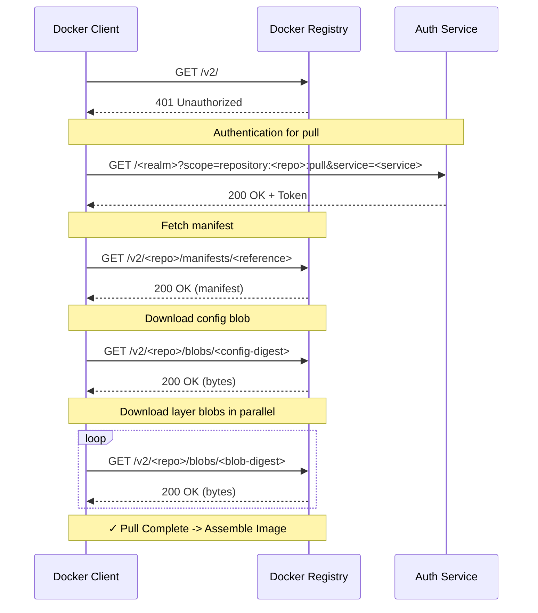

### Docker Image Download Process

For download process visualization, see the sequence diagram below:

```mermaid
sequenceDiagram
    participant Client as Docker Client
    participant Registry as Docker Registry
    participant Auth as Auth Service
    Client ->> Registry: GET /v2/
    Registry -->> Client: 401 Unauthorized
    Note over Client, Auth: Authentication for pull
    Client ->> Auth: GET /<realm>?scope=repository:<repo>:pull&service=<service>
    Auth -->> Client: 200 OK + Token
    Note over Client, Registry: Fetch manifest
    Client ->> Registry: GET /v2/<repo>/manifests/<reference>
    Registry -->> Client: 200 OK (manifest)
    Note over Client, Registry: Download config blob
    Client ->> Registry: GET /v2/<repo>/blobs/<config-digest>
    Registry -->> Client: 200 OK (bytes)
    Note over Client, Registry: Download layer blobs in parallel
    loop
        Client ->> Registry: GET /v2/<repo>/blobs/<blob-digest>
        Registry -->> Client: 200 OK (bytes)
    end
    Note over Client, Registry: ✓ Pull Complete -> Assemble Image
```