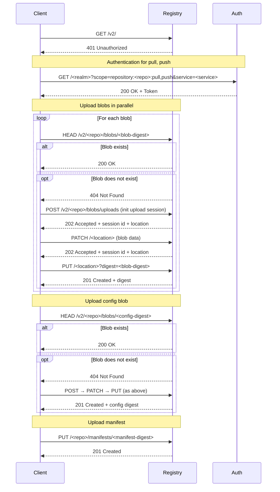

### Docker Image Upload Process

For upload process visualization, see the sequence diagram below:

```mermaid
sequenceDiagram
    participant Client
    participant Registry
    participant Auth
    Client ->> Registry: GET /v2/
    Registry -->> Client: 401 Unauthorized
    Note over Client, Auth: Authentication for pull, push
    Client ->> Auth: GET /<realm>?scope=repository:<repo>:pull,push&service=<service>
    Auth -->> Client: 200 OK + Token
    Note over Client, Registry: Upload blobs in parallel
    loop For each blob
        Client ->> Registry: HEAD /v2/<repo>/blobs/<blob-digest>
        alt Blob exists
            Registry -->> Client: 200 OK
        else
        end
        opt Blob does not exist
            Registry -->> Client: 404 Not Found
            Client ->> Registry: POST /v2/<repo>/blobs/uploads (init upload session)
            Registry -->> Client: 202 Accepted + session id + location
            Client ->> Registry: PATCH /<location> (blob data)
            Registry -->> Client: 202 Accepted + session id + location
            Client ->> Registry: PUT /<location>?digest=<blob-digest>
            Registry -->> Client: 201 Created + digest
        end
    end
    Note over Client, Registry: Upload config blob
    Client ->> Registry: HEAD /v2/<repo>/blobs/<config-digest>
    alt Blob exists
        Registry -->> Client: 200 OK
    else
    end
    opt Blob does not exist
        Registry -->> Client: 404 Not Found
        Client ->> Registry: POST → PATCH → PUT (as above)
        Registry -->> Client: 201 Created + config digest
    end
    Note over Client, Registry: Upload manifest
    Client ->> Registry: PUT /<repo>/manifests/<manifest-digest>
    Registry -->> Client: 201 Created

```